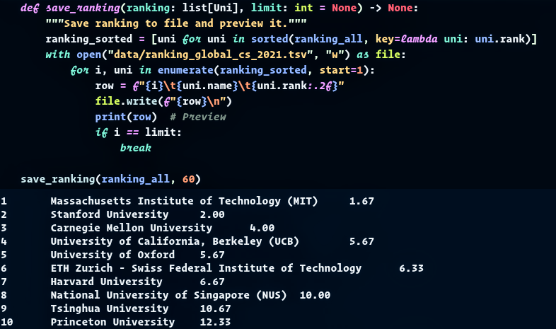

# World Top CS Universities 2021

## Goal

Combine leading university rankings into one using Python and JupyterLab.

## Data

* [QS: World University Rankings 2021 — Computer Science & Information Systems](https://www.topuniversities.com/university-rankings/university-subject-rankings/2021/computer-science-information-systems)
* [Times Higher Education: World University Rankings 2021 — Computer Science](https://www.timeshighereducation.com/world-university-rankings/2021/subject-ranking/computer-science)
* [Shanghai Ranking Consultancy: Academic Ranking of World Universities 2020 — Computer Science & Engineering](http://www.shanghairanking.com/Shanghairanking-Subject-Rankings/computer-science-engineering.html)

## Output

