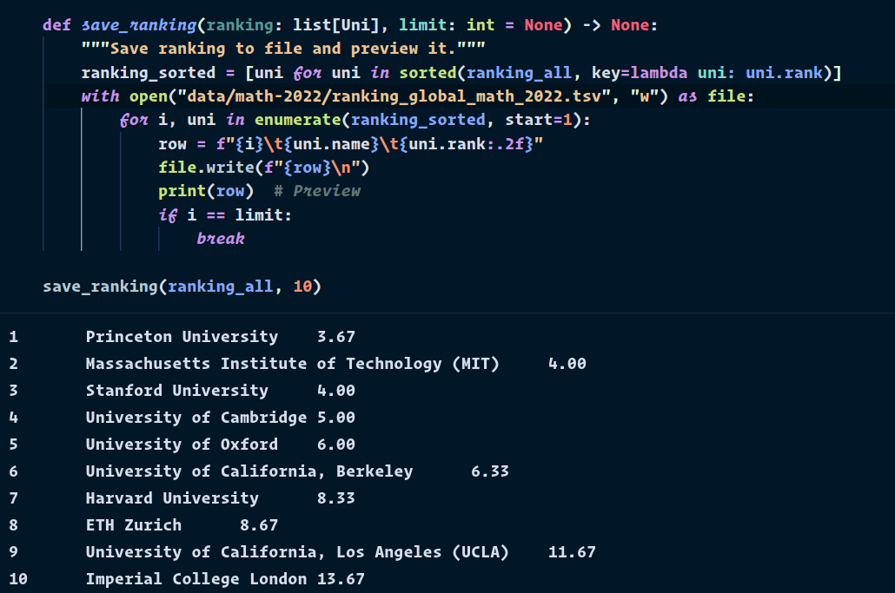

# World Top Universities 2022

## Goal

Combine leading university rankings into one using Python and JupyterLab.

## Articles

* [600+ Free Computer Science Courses from World’s Top 50 Universities](https://www.classcentral.com/report/cs-online-courses/)
* [100+ Math Courses from the World’s Top CS Universities](https://www.classcentral.com/report/mathematics-statistics-free-online-courses/)

## Data

### Computer Science 2022

* QS: [World University Ranking 2021 — Computer Science and IT](https://www.topuniversities.com/university-rankings/university-subject-rankings/2021/computer-science-information-systems)
* Times Higher Education: [World University Ranking 2022 — Computer Science](https://www.timeshighereducation.com/world-university-rankings/2022/subject-ranking/computer-science#!/page/0/length/25/sort_by/rank/sort_order/asc/cols/stats)
* Shanghai Ranking: [Academic Ranking of World Universities 2021 — Computer Science & Engineering](https://www.shanghairanking.com/rankings/gras/2021/RS0210)

### Mathematics 2022

* QS: [World University Ranking 2021 — Mathematics](https://www.topuniversities.com/university-rankings/university-subject-rankings/2021/mathematics)
* Times Higher Education: [World University Ranking 2022 — Physical Sciences](https://www.timeshighereducation.com/world-university-rankings/2022/subject-ranking/computer-science#!/page/0/length/25/sort_by/rank/sort_order/asc/cols/stats)
* Shanghai Ranking: [Academic Ranking of World Universities 2021 — Mathematics](https://www.shanghairanking.com/rankings/gras/2021/RS0101)

## Output



## Usage

**First**, add the ranking info (e.g. URLs) to `ranking_scraper/ranking_scraper/settings.py`.

**Second**, to scrape the rankings, run the following commands:

```
$ cd top-universities/ranking_scraper
$ scrapy crawl the_spider -o ranking_scraper/data/input/<subject>_<year>/the.csv
$ scrapy crawl qs_spider -o ranking_scraper/data/input/<subject>_<year>/qs.csv
$ scrapy crawl arwu_spider -o ranking_scraper/data/input/<subject>_<year>/arwu.csv
```
**Third**, run the Jupyter Notebook.

## 2023 Usage

```
$ cd top-universities/scraper
$ scrapy crawl qs -O data_scraped/qs.jsonl
$ scrapy crawl the -O data_scraped/the.jsonl
$ scrapy crawl arwu -O data_scraped/arwu.jsonl
```
