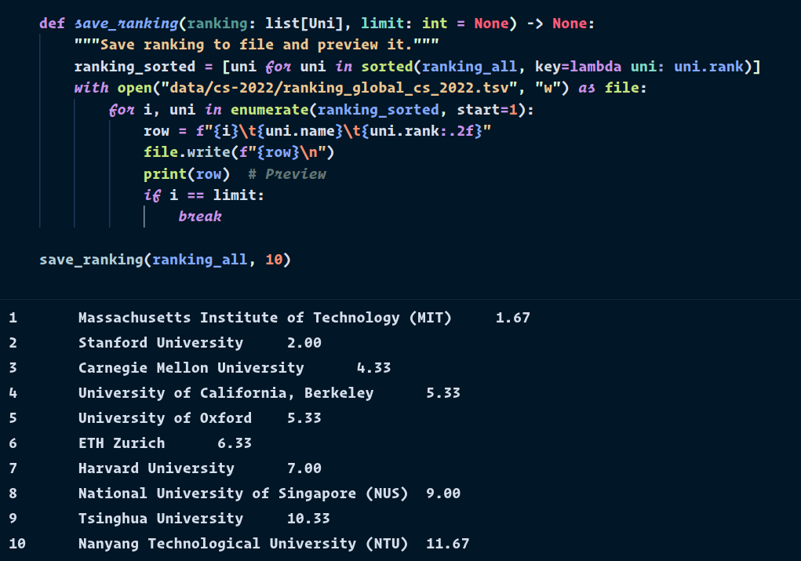

# World Top CS Universities 2022

## Goal

Combine leading university rankings into one using Python and JupyterLab.

## Article

[600 Free Computer Science Courses from the World’s Top CS Universities](https://www.classcentral.com/report/cs-online-courses/)

## Data

* Times Higher Education: [World University Ranking 2022 — Computer Science](https://www.timeshighereducation.com/world-university-rankings/2022/subject-ranking/computer-science#!/page/0/length/25/sort_by/rank/sort_order/asc/cols/stats)
* QS: [World University Ranking 2021 — Computer Science and IT](https://www.topuniversities.com/university-rankings/university-subject-rankings/2021/computer-science-information-systems)
* Shanghai Ranking: [Academic Ranking of World Universities 2021 — Computer Science & Engineering](https://www.shanghairanking.com/rankings/gras/2021/RS0210)

## Output

